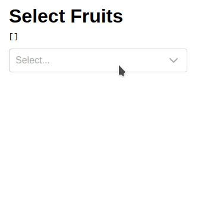

# react-multi-select-component

Simple and lightweight multiple selection dropdown component with `checkboxes`, `search` and `select-all`

[](https://react-multi-select-component.netlify.com)
[](https://github.com/harshzalavadiya/react-multi-select-component/actions)
[](https://npm.im/react-multi-select-component)
[](https://bundlephobia.com/result?p=react-multi-select-component@latest)

## ✨ Features

- 🍃 Lightweight (<5KB)
- 💅 Themeable
- ✌ Written w/ TypeScript

## 🔧 Installation

```bash
npm i react-multi-select-component    # npm
yarn add react-multi-select-component # yarn
```

## 📦 Example



```tsx
import React, { useState } from "react";
import MultiSelect from "react-multi-select-component";

const Example: React.FC = () => {
  const options = [
    { label: "Grapes 🍇", value: "grapes" },
    { label: "Mango 🥭", value: "mango" },
    { label: "Strawberry 🍓", value: "strawberry", disabled: true },
    { label: "Watermelon 🍉", value: "watermelon" },
    { label: "Pear 🍐", value: "pear" },
    { label: "Apple 🍎", value: "apple" },
    { label: "Tangerine 🍊", value: "tangerine" },
    { label: "Pineapple 🍍", value: "pineapple" },
    { label: "Peach 🍑", value: "peach" },
  ];

  const [selected, setSelected] = useState([]);

  return (
    <div>
      <h1>Select Fruits</h1>
      <pre>{JSON.stringify(selected)}</pre>
      <MultiSelect
        options={options}
        value={selected}
        onChange={setSelected}
        labelledBy={"Select"}
      />
    </div>
  );
};

export default Example;
```

## 👀 Props

| Prop                  | Description                                                           | Type                         | Default        |
| --------------------- | --------------------------------------------------------------------- | ---------------------------- | -------------- |
| `labelledBy`          | value for `aria-labelledby`                                           | `string`                     |                |
| `options`             | options for dropdown                                                  | `[{label, value, disabled}]` |                |
| `value`               | pre-selected rows                                                     | `[{label, value}]`           | `[]`           |
| `focusSearchOnOpen`   | focus on search input when opening                                    | `boolean`                    | `true`         |
| `hasSelectAll`        | toggle 'Select All' option                                            | `boolean`                    | `true`         |
| `isLoading`           | show spinner on select                                                | `boolean`                    | `false`        |
| `shouldToggleOnHover` | toggle dropdown on hover option                                       | `boolean`                    | `false`        |
| `overrideStrings`     | i18n [docs](#-internationalization)                                   | `object`                     |                |
| `onChange`            | onChange callback                                                     | `function`                   |                |
| `disabled`            | disable dropdown                                                      | `boolean`                    | `false`        |
| `selectAllLabel`      | _select all_ label                                                    | `string`                     |                |
| `disableSearch`       | hide search textbox                                                   | `boolean`                    | `false`        |
| `filterOptions`       | custom filter options (async supported) [docs](#-custom-filter-logic) | `function`                   | Fuzzy Search   |
| `className`           | class name for parent component                                       | `string`                     | `multi-select` |
| `valueRenderer`       | custom dropdown header [docs](#-custom-value-renderer)                | `function`                   |                |
| `ItemRenderer`        | custom dropdown option [docs](#-custom-item-renderer)                 | `function`                   |                |
| `ClearIcon`           | Custom Clear Icon for Search                                          | `JSX.element`                |                |
| `ArrowRenderer`       | Custom Arrow Icon for Dropdown                                        | `JSX.element`                |                |
| `debounceDuration`    | debounce duraion for Search                                           | `number`                     | `300`          |
| `ClearSelectedIcon`   | Custom Clear Icon for Selected Items                                  | `JSX.element`                | `function`     |

## 🔍 Custom filter logic

By default this component uses a fuzzy search algorithm to filter options but also allows you to opt-out and use your custom logic if you want to below is the example doing just case insensitive search

```js
export function filterOptions(options, filter) {
  if (!filter) {
    return options;
  }
  const re = new RegExp(filter, "i");
  return options.filter(({ value }) => value && value.match(re));
}
```

## 🌐 Internationalization

You can easily Internationalize this component by passing prop `overrideStrings` so that UI strings can be presented in a different language

default values for `overrideStrings` are as below

```json
{
  "allItemsAreSelected": "All items are selected.",
  "clearSearch": "Clear Search",
  "noOptions": "No options",
  "search": "Search",
  "selectAll": "Select All",
  "selectSomeItems": "Select..."
}
```

## 🎛 Custom Value Renderer

Optionally customise value renderer view by passing `valueRenderer` prop

```js
const customValueRenderer = (selected, _options) => {
  return selected.length
    ? selected.map(({ label }) => "✔️ " + label)
    : "😶 No Items Selected";
};
```

## 🎛 Custom Item Renderer

Optionally customise dropdown item by passing `ItemRenderer` prop

[Default Item Renderer](https://github.com/harshzalavadiya/react-multi-select-component/blob/master/src/select-panel/default-item.tsx#L27-L47)

## 💅 Themeing

You can override CSS variables to customize the appearance

```css
.multi-select {
  --rmsc-main: #4285f4;
  --rmsc-hover: #f1f3f5;
  --rmsc-selected: #e2e6ea;
  --rmsc-border: #ccc;
  --rmsc-gray: #aaa;
  --rmsc-bg: #fff;
  --rmsc-p: 10px; /* Spacing */
  --rmsc-radius: 4px; /* Radius */
  --rmsc-h: 38px; /* Height */
}
```

> use `!important` if CSS variables are not getting applied

## 🤠 Credits

- This project gets inspiration and several pieces of logical code from [react-multiple-select](https://github.com/Khan/react-multi-select/)
- [TypeScript](https://github.com/microsoft/typescript)
- [TSDX](https://github.com/jaredpalmer/tsdx)
- [Goober](https://github.com/cristianbote/goober)

## 📜 License

MIT &copy; [harshzalavadiya](https://github.com/harshzalavadiya)
